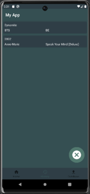

# My Music Identification App

## Description

This is an Android app similar to Shazam, designed to recognize and identify songs from audio samples.  
The app uses java with android sdk. Users can record a short audio clip and the app will attempt to identify the song by matching it with its database of songs.  
In this repo, I took the database away due to size, you can create your own database (in this project I use sqlite) but make sure you have a table name called "songinfo" and this table has to have the following columns:
id, song_name, artist, album, fingerprint, blob_image.

## Features

- Record a short audio clip.
- Song recognition from audio samples.
- UI design
- Searching history

## Screenshots

## Demo Video

## Installation

- Java with Android SDK
- Install Android Studio
- Clone the repo
- Build the project
- Run on emulator

## Database Setup

To use this app, you need to create your own database. I use SQLite in this project. Make sure you have a table named "songinfo" with the following columns:

- `id`
- `song_name`
- `artist`
- `album`
- `fingerprint`
- `blob_image`

### Importing the Database

To import the database (SQLite) into the app, follow these steps:

1. Place your `.db` file under the `assets` folder in the project.
2. Navigate to the database page within the app.
3. Press the "Import database" button.

Please note that the actual database has been removed from this repository due to its size.

Make sure to set up the database correctly for the app to function properly.

## How to Use

- Make sure the app has the permission to record the audio
- Click the button to start listening (4 seconds at least, by default I set up to 12 seconds)
- It will search the database to find the matching song

## Technologies Used

- Android SDK
- Java
- SQLite

## How to Contribute

Contributions are welcome! If you want to contribute to this project, follow these steps:

1. Fork the repository.
2. Create a new branch: `git checkout -b new-branch`
3. Make your changes and commit them: `git commit -m "Add some feature"`
4. Push to the branch: `git push origin my-feature-branch`
5. Submit a pull request.

Please make sure your code follows the project's coding conventions and includes appropriate tests.

## Bugs and Issues

If you encounter any bugs or issues with the app, please let me know by opening an issue on the [GitHub repository](https://github.com/elwin212/music_recogn/issues).

## License

This project is licensed under the MIT License.

For the application architecture you can refer to this link https://drive.google.com/file/d/1ljrocl6fSWki4dqNILkc_KMA_WHtZ0ON/view.
